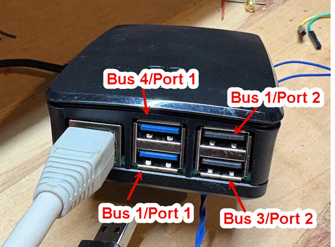

One of the annoying problems with Linux USB sound cards is the 
dynamic way in which card/device numbers are assigned. This applies 
to ALSA card numbers, OSS device numbers, and HID 
device numbers. Sometimes a system reboot, the addition or a new device, or just random 
chance can cause the devices to be re-numbered. This can cause an application
to malfunction if it is configured to use a sound device that suddenly 
changes its number.  There's [a good discussion of this problem here]https://github.com/AllStarLink/app_rpt/issues/815) in the form of a Github issue.

This library provides a way to increase reliability by allowing a user
to specify a USB sound device **using a physical USB bus number, a physical
USB port number, a USB vendor/product code or any combination of these**.
The advantage of physical hardware designations and vendor/product codes
is that they are immutable and won't be disrupted by a reboot.

This library has no external dependencies other than Linux [libusb](https://libusb.info/). It was 
written to be used in the Ampersand ASL server, but it is provided as an 
independent module for possible use in other places. It might be interesting to try to 
plug it into app_rpt as well.

The querySoundMap() function takes a query string that look like any of the following:

    vendor:0d8c
    vendorname:"C-Media  Electronics, Inc."
    vendor:0d8c,product:0001
    bus:3,vendor:0d8c
    bus:3,port:2

The first three cases look for devices identified by vendor codes/names. If only one device
from that vendor is attached to the system then everything is fine. If more than one
is connected (for example, two USB sound interfaces with the same CM108 chip inside)
then you will need to use a more specific query that identifies the physical port.

A full application would allow the user to configure their system using a query
string like the ones shown above (for example, in an .INI file or on a configuration 
screen) and would then call the querySoundMap() function at startup to get the actual 
Linux device names that it should use internally at run time.

Example Program 1
=================

```c++
#include <iostream>
#include "sound-map.h"

using namespace std;

int main(int, const char**) {
    
    char hidDev[32];
    char alsaDev[32];
    char ossDev[32];

    int rc = querySoundMap("bus:3,port:2", hidDev, 32, alsaDev, 32, ossDev, 32);
    if (rc < 0) {
        cout << "ERROR: " << rc << endl;
        return -1;
    }

    cout << "Found the device:" << endl;
    cout << " HID   : " << hidDev << endl;
    cout << " ALSA  : " << alsaDev << endl;
    cout << " OSS   : " << ossDev << endl;

    return 0;
}
```

I ran this with my USB sound device plugged into the bottom right USB jack on
my Raspberry Pi 5. The output looks like this:

        Found the device:
         HID   : /dev/hidraw0
         ALSA  : 1,0
         OSS   : /dev/dsp1

Then I unplugged the USB sound device, plugged another one into the top right 
USB jack and plugged the original device back into the original (bottom right)
jack. When running again the output looks like this:

        Found the device:
         HID   : /dev/hidraw1
         ALSA  : 3,0
         OSS   : /dev/dsp3

It's the same device in the same port, but it gets assigned new Linux device 
identifiers when the USB drivers re-enumerate the hardware. That's the problem being solved.

For modern applications you probably don't care about the OSS device name, just disregard it.

Example Program 2
=================

This example demonstrates searching by the human-readable vendor name. This would probably
be the logical "default" query to use. For a system that had a single audio interface based
on the CM1xx chip it would just find the device on the bus without any other input.

```c++
#include <iostream>
#include "sound-map.h"

using namespace std;

int main(int, const char**) {
    
    const char* targetVendorName = "C-Media Electronics, Inc.";
    char query[64];
    snprintf(query, 64, "vendorname:\"%s\"", targetVendorName);

    char hidDev[32];
    char alsaDev[32];
    char ossDev[32];

    int rc = querySoundMap(query, hidDev, 32, alsaDev, 32, ossDev, 32);
    if (rc < 0) {
        cout << "ERROR: " << rc << endl;
        return -1;
    }

    cout << "Found the device:" << endl;
    cout << " HID   : " << hidDev << endl;
    cout << " ALSA  : " << alsaDev << endl;
    cout << " OSS   : " << ossDev << endl;

    return 0;
}
```
I ran this with my [AllScan URI101 USB sound device](https://allscan.info/products/) plugged into the bottom right USB jack on my Raspberry Pi 5. The output looks like this:

    Found the device:
     HID   : /dev/hidraw1
     ALSA  : 3,0
     OSS   : /dev/dsp3

Physical Port Reference
=======================

This is a Raspberry Pi 4:


(Looking straight on to the side with the USB ports: top left bus 1/port 3, top right bus 1/port 1, bottom left bus 1/port 4, bottom right bus 1/port 2).

This is a Raspberry Pi 5:



(Looking straight on to the side with the USB ports: top left bus 4/port 1, top right bus 1/port 2, bottom left bus 1/port 1, bottom right bus 3/port 2).

If you have the physical arrangement for any other common ASL device please send it a along
and I'll add it to this page.

